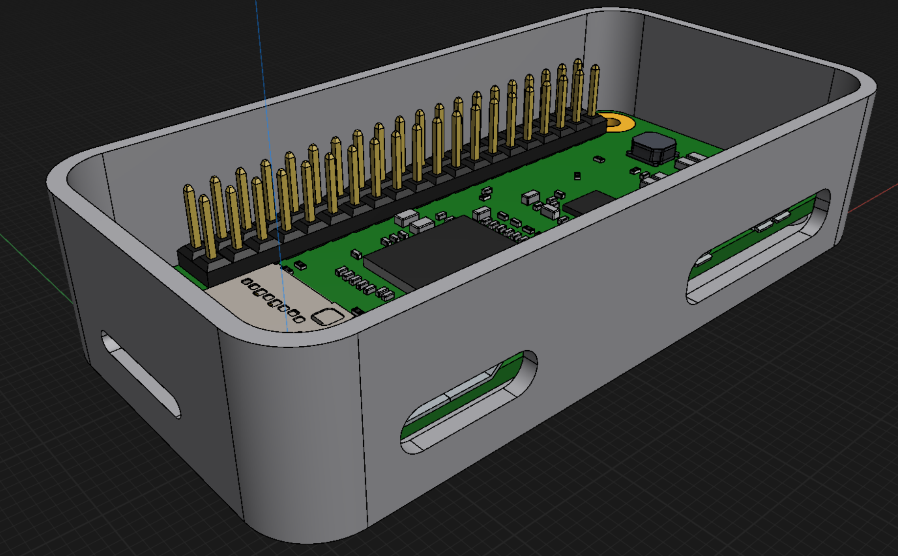
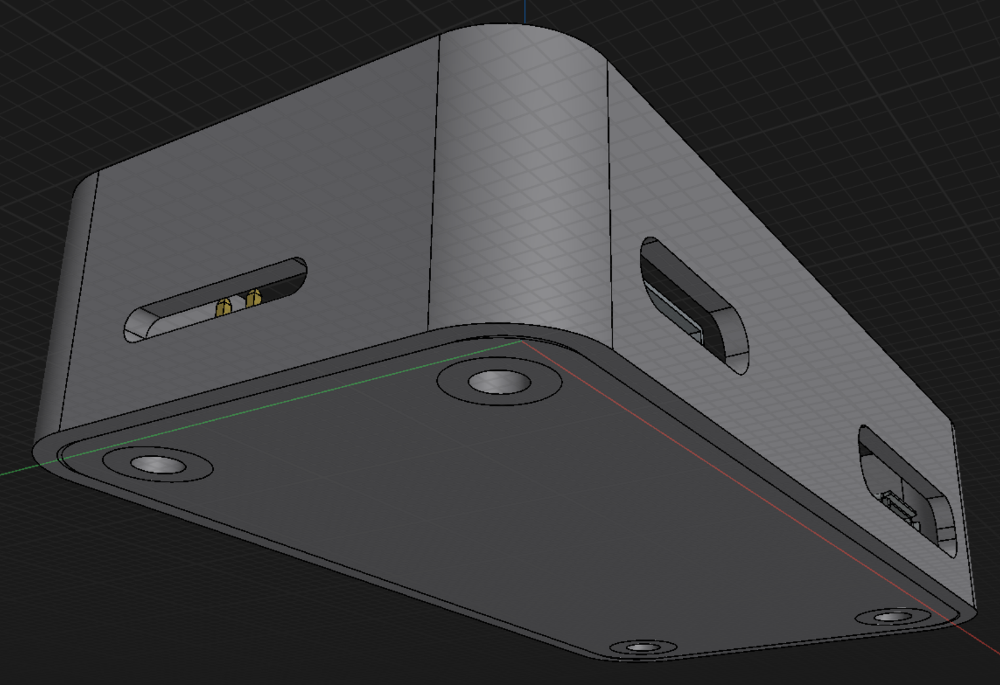
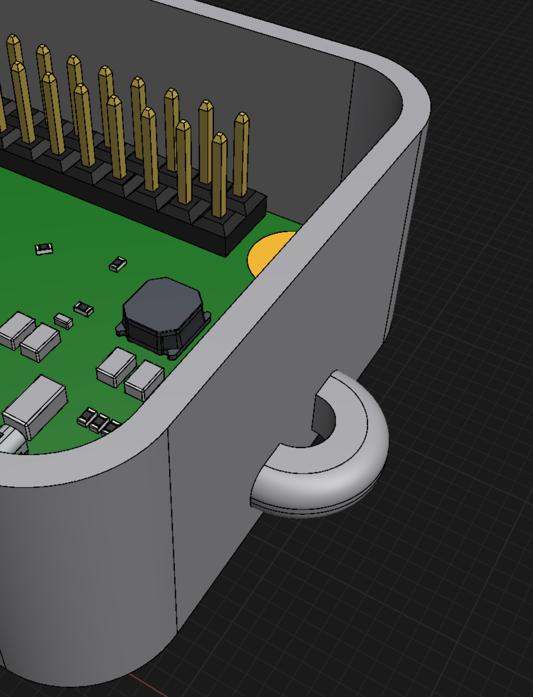

# Pwnagotchi
The cutest wifi packet sniffer :3

# CAD Model
I made a custom case to print for the RP0 and the E-Paper display. The model is available in [cad/case.3mf](cad/case.3mf).

I added a lanyard loop to the side of the case as well! :D

The top part of the case will be designed when I receive the E-Paper display, to ensure a perfect fit.

# Assembly
The assembly should be pretty straightforward: Solder the header pins onto the RP0 module, then solder some wires from the RTC to the RP0. Tape the RTC module to isolate it from contacting with the RP0 or the Display. And then just plug the display onto the RP0 module headers. Finally the RP0 module can be screwed into the case! :P

The top part of the case will probably be glued on once the display is in place.

# BOM
This project is very low cost. The only components are the Display, the RP0 module and an RTC clock battery.

| Component | Part / Model | Qty | Price |
| :--- | :--- | :--- | :--- |
| **Microcontroller** | Raspberry Pi RP0 | 1 | 17.99
| **E-Paper Display** | 2.9" Waveshare EPaper HAT | 1 | 16.21 |
| **RTC Module** | DS3231 RTC Module | 1 | 1.94

Total estimated cost: 36.14€, $42.28

As I already had some of the components, my total cost will only be around 20 dollars. :)

# Resources
- [Pwnagotchi Org](https://pwnagotchi.org)
- [Pwnagotchi AI](https://pwnagotchi.ai/)